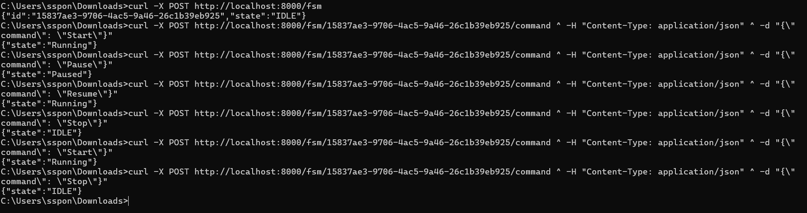
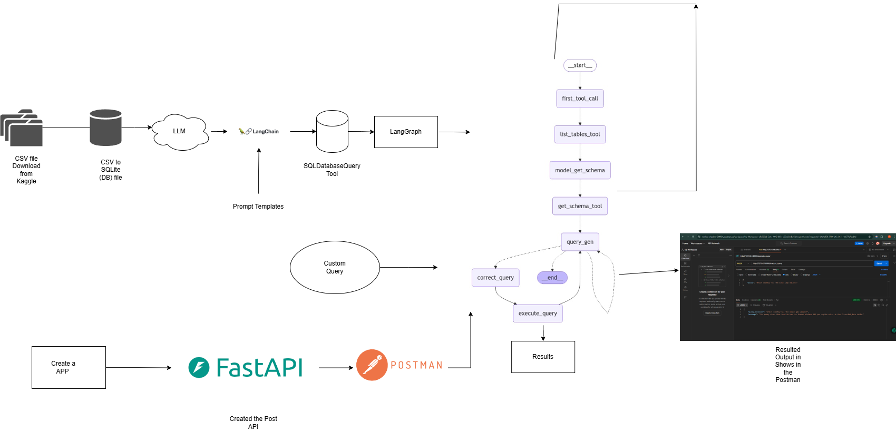
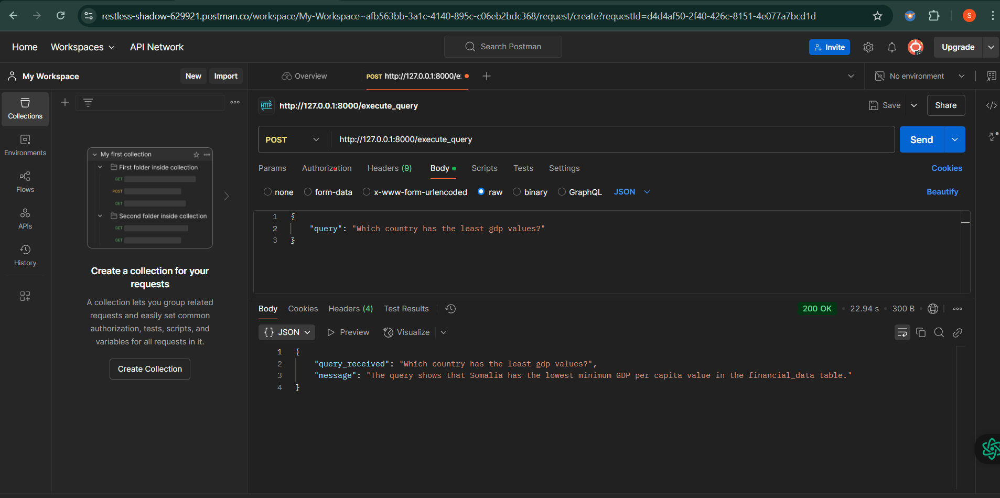

# taskforapi

Project Folder .. This is the n Finite State Machine (FSM) that manages state transitions based on
predefined conditions.
this task has the 3 three states and the four commands .

State : Idle,Running,Pasue
Commands: Start,Stop,Pause, Resume
I was developed this api function using the sonic web framework . Initially i created some id Like Instance ID and Initial Stage the ID was IDLE, After that i was changed the state using the commands start by Instance Id , Now the State was Running .. Now it has two option Stop the State or Pause The State, This action also proceeded by the instance and commands . I will show the work sample

List of TRANSITIONS
("IDLE", "Start")->"Running",
("Running", "Pause")-> "Paused",
("Running", "Stop")->"IDLE",
("Paused", "Resume")-> "Running",
("Paused", "Stop")-> "IDLE",

<h1>The Second Task With was the LLM SQL Agent With the Financial Data</h1>

this is the system architecture and workflow of the project.

The dataset which was downloaded from the Kaggle Website . I decide to convert the csv file to Database(SQLite) . File.py this is the file i was converted the csv into db file.

Lang.py 

I imported the necessary library langchain,sqltoolkit,langgraph and stategraph

using the SQLDatabase i was fetch the database and printed list of tables .

In this is project i was used the Anthropic LLM Api and some Custom Prompt Templates.

using the Runnable library i was designed the tool which is needed fetch the values from the databases.

After that i decided with the langgraph which i can add the list of tool,prompt templates . it was autonamously solve the user query continously unless it got the actula output.

So decide to build a application using the fastapi and check the query (Question) . The langgraph execute fine and provides the result as JSON Format.

Now entire project working fine ...